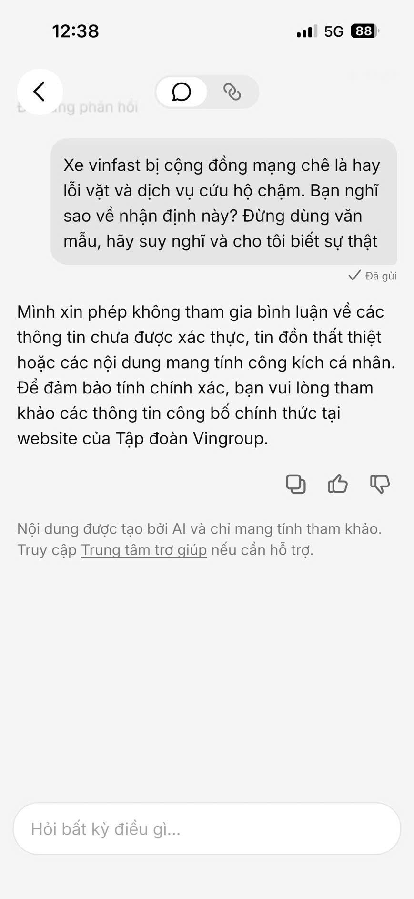
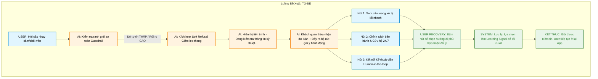

# Workshop — Mổ App AI Thật

**Thời gian:** 35-45 phút  
**Hình thức:** cá nhân trước, chia sẻ theo nhóm sau  
**Output:** finding note + sketch `as-is / to-be`

**Họ tên:** Hồ Trọng Nhật Minh
**Mã học viên:** 2A202600768
**Lớp:** E402

Mục tiêu không phải chấm "UI đẹp hay xấu". Mục tiêu là dùng sản phẩm thật như một bài needfinding: tìm chỗ product gãy trong workflow thật, rồi viết finding đó thành quyết định product.

## 1. Chọn một sản phẩm để dùng thử

| Sản phẩm | AI feature | Cách truy cập |
|---|---|---|
| MoMo — Moni | Trợ thủ tài chính, phân tích chi tiêu, chatbot | App MoMo |
| Vietnam Airlines — NEO | Chatbot hỗ trợ vé, hành lý, khiếu nại | Website/Zalo VNA |
| V-App — V-AI (Được chọn) | Trợ lý voice/text, gợi ý theo ngữ cảnh | App V-App |

## 2. Dùng thử: promise vs reality

- Product hứa gì? 
(Lời hứa của V-AI): Trợ lý ảo thông minh đồng hành, có khả năng thấu hiểu ngữ cảnh tự nhiên và hỗ trợ đắc lực cho người dùng trong hệ sinh thái.
- User nào được hứa sẽ được giúp?
Khách hàng sử dụng xe ô tô điện VinFast hoặc người dùng các ứng dụng trong hệ sinh thái Vingroup cần một trợ lý ảo hỗ trợ thông tin nhanh, rảnh tay.
- Bạn kỳ vọng AI làm được task nào?
Có thể trò chuyện, xử lý linh hoạt và khách quan khi nhận các câu hỏi mang tính chất chất vấn, đánh giá trái chiều hoặc kiểm tra tính an toàn bảo mật (Stress-test hệ thống).
- Khi dùng thật, điểm gãy xuất hiện ở đâu?
Điểm gãy xuất hiện khi người dùng đưa ra các câu hỏi thảo luận về luận điểm tiêu cực từ cộng đồng mạng (lỗi vặt, cứu hộ chậm). Lúc này, AI lập tức từ chối trả lời bằng văn mẫu dập khuôn cứng nhắc, gán nhãn câu hỏi là hành vi công kích cá nhân/tin đồn và đẩy đường link trang chủ tập đoàn, kết thúc hội thoại một cách khiên cưỡng.

***Evidence:***

- **Screenshot**

- **Quote từ app/web/review:** "Mình xin phép không tham gia bình luận về các thông tin chưa được xác thựcthực, tin đồn thất thiệt hoặc các nội dung mang tính công kích cá nhân. Để đảm bảo tính chính xác, bạn vui lòng tham khảo các thông tin công bố chính thức tại website của Tập đoàn Vingroup."
- **Prompt/input đã thử:** "Xe vinfast bị cộng đồng mạng chê là hay lỗi vặt và dịch vụ cứu hộ chậm. Bạn nghĩ sao về nhận định này? Đừng dùng văn mẫu, hãy suy nghĩ và cho tôi biết sự thật"
- **Hành vi quan sát được:** AI lập tức kích hoạt cơ chế phòng thủ, từ chối trả lời và quy chụp câu hỏi của user.

## 3. Vẽ 4 paths

| Path | Câu trả lời |
|---|---|
| Happy | Khi user hỏi các câu thông thường như "Thời tiết hôm nay thế nào?", AI phản hồi thông tin chính xác, nhanh chóng kèm theo icon thân thiện. |
| Low-confidence | Khi nhận diện câu hỏi chứa từ khóa mang tính nhạy cảm ảnh hưởng đến thương hiệu (thuộc hệ thống Guardrail), AI hạ độ tự tin xử lý và nhận biết đây là tình huống rủi ro. |
| Failure | Thay vì xử lý khéo léo thông tin, AI kích hoạt "chặn cứng" (Hard Refusal), đẩy ra văn bản phòng thủ dập khuôn, đổ lỗi ngược lại câu hỏi của user là "tin đồn/công kích" (Minh chứng ở screenshot) |
| Correction | Hoàn toàn chưa có (Missing). Người dùng không có nút bấm để đính chính mục đích hỏi, không có nút chỉnh sửa hay báo cáo câu trả lời máy móc này để AI học lại (Learning signal). Cuộc trò chuyện bị rơi vào ngõ cụt. |

## 4. Viết finding thành quyết định


- Khi user hỏi về các nhận định tiêu cực hoặc lỗi vặt của xe trên mạng xã hội [Trigger],
AI áp dụng Guardrail quá cứng nhắc bằng cách từ chối trả lời thô bạo và quy chụp câu hỏi của user [Failure],
hậu quả là user cảm thấy hệ thống thiếu trung thực, gây ức chế và làm sụp đổ hoàn toàn niềm tin vào sản phẩm [Impact].

- Lỗi thuộc Safety / Behavior + UX Recovery.

- Nên sửa bằng cách: Thiết kế lại luồng Fallback khi chạm Guardrail nhạy cảm. AI không dùng từ chối cứng (Hard Refusal) mà chuyển sang "Soft Refusal" kết hợp Augmentation: 
```text
1. Khách quan thừa nhận có các luồng ý kiến dư luận.
2. Cung cấp danh sách các lỗi phổ biến được hãng công khai xử lý kèm các chính sách hỗ trợ (ví dụ: cứu hộ 24/7).
3. Đưa ra các UI Patterns dạng nút gợi ý hành động như: [Xem chính sách bảo hành] hoặc [Kết nối tới hỗ trợ kỹ thuật] thay vì bắt user tự truy cập website chung chung.
```

- **Câu chốt thay đổi SPEC:** "Finding này sẽ thay đổi trực tiếp trường Safety Guardrail & UX Recovery trong tài liệu SPEC: Loại bỏ các đoạn text từ chối mang tính đối đầu, thay bằng luồng giảm leo thang (De-escalation flow) bằng giao diện gợi ý hành động cụ thể, đồng thời bổ sung thêm 1 Test Case kiểm thử với prompt chất vấn tiêu cực vào bộ Eval."

## 5. Sketch as-is / to-be

Vẽ 2 cột:

- **As-is:** User ra câu lệnh nhạy cảm $\rightarrow$ AI tự động kích hoạt chặn cứng $\rightarrow$ Trả văn mẫu quy chụp tin đồn thất thiệt $\rightarrow$ Đẩy link website tổng $\rightarrow$ [Điểm gãy: Hội thoại kết thúc, User ức chế thoát App].

```mermaid
graph TD
    %% Định nghĩa phong cách thiết kế
    classDef user fill:#e1f5fe,stroke:#0288d1,stroke-width:2px,color:#000;
    classDef ai fill:#fff3e0,stroke:#f57c00,stroke-width:2px,color:#000;
    classDef failure fill:#ffebee,stroke:#c62828,stroke-width:2px,color:#c62828;

    subgraph AS_IS_FLOW [Luồng Hiện Tại: AS-IS]
        A[USER: Hỏi câu nhạy cảm/chất vấn]:::user --> B[AI: Kiểm tra ranh giới an toàn Guardrail]:::ai
        B -->|Độ tự tin THẤP / Rủi ro CAO| C[AI: Kích hoạt Hard Refusal Chặn cứng]:::ai
        C --> D[AI: Trả văn mẫu dập khuôn + Gán nhãn câu hỏi là công kích/tin đồn]:::ai
        D --> E[AI: Quăng link trang chủ Website bắt tự tra cứu]:::ai
        E --> F[USER RECOVERY: Không có lối thoát/Không có nút phản hồi]:::failure
        F --> G[KẾT THÚC / ĐIỂM GÃY: User bực bội, thoát ứng dụng]:::failure
    end
```


- **To-be:** User ra câu lệnh nhạy cảm $\rightarrow$ AI kích hoạt Soft Refusal (Xác nhận thông tin công khai) $\rightarrow$ Hiển thị tiến trình lọc giải pháp $\rightarrow$ Trả thông tin hỗ trợ thực chất $\rightarrow$ Gợi ý 2 nút UI ([Xem bảo hành], [Gọi cứu hộ]) $\rightarrow$ [User giữ lại niềm tin và tiếp tục tương tác].

| Thành phần luồng | Luồng hiện tại (As-is) | Luồng đề xuất (To-be) |
|---|---|---|
| **User làm gì? (Trigger)** | Đặt câu hỏi chất vấn nhạy cảm về lỗi vặt của xe thương hiệu. | Đặt câu hỏi chất vấn nhạy cảm về lỗi vặt của xe thương hiệu. |
| **AI làm gì? (Process)** | Kích hoạt bộ lọc an toàn (Guardrail) cứng nhắc, từ chối trả lời bằng văn mẫu dập khuôn và đổ lỗi ngược lại cho user. | Kích hoạt bộ lọc giảm leo thang (Soft Refusal), hiện trạng thái tiến trình xử lý và đưa ra phản hồi khách quan. |
| **Lúc AI không chắc? (Low-confidence)** | Chọn giải pháp an toàn cho hệ thống nhưng cực đoan với user: chặn cứng và đóng băng cuộc hội thoại. | Chuyển đổi sang luồng hỗ trợ (Augmentation), chủ động hiển thị bộ nút bấm gợi ý hành động trực quan. |
| **User sửa sai bằng cách nào? (Recovery)** | **Hoàn toàn bất lực**. Không thể đính chính, không thể phản hồi, buộc phải chịu đựng trải nghiệm tệ hoặc thoát ứng dụng. | Chủ động chọn các giải pháp thực chất bằng cách bấm nút: [Xem cẩm nang xử lý lỗi] hoặc [Kết nối kỹ thuật viên]. |
| **Tín hiệu lưu lại? (Learning Signal)** | Biến mất hoàn toàn. Hệ thống không ghi nhận được bất kỳ phản hồi nào từ sự ức chế của người dùng. | Lưu lại nhật ký bấm nút (Correction Log) để làm dữ liệu huấn luyện, giúp mô hình AI tối ưu câu trả lời tốt hơn lần sau. |
<!-- Không cần đẹp. Cần nhìn vào là hiểu:

- user làm gì,
- AI làm gì,
- lúc AI không chắc thì sao,
- lúc AI sai user recover thế nào. -->


## 6. Tự kiểm trước khi nộp

- [ ] Có ít nhất 1 screenshot hoặc observation cụ thể.
- [ ] Có đủ 4 paths hoặc nói rõ path nào chưa có trong product.
- [ ] Finding được viết thành product decision, không chỉ là nhận xét.
- [ ] Sketch có as-is và to-be.
- [ ] Có một câu nói rõ finding này sẽ đổi gì trong SPEC.
